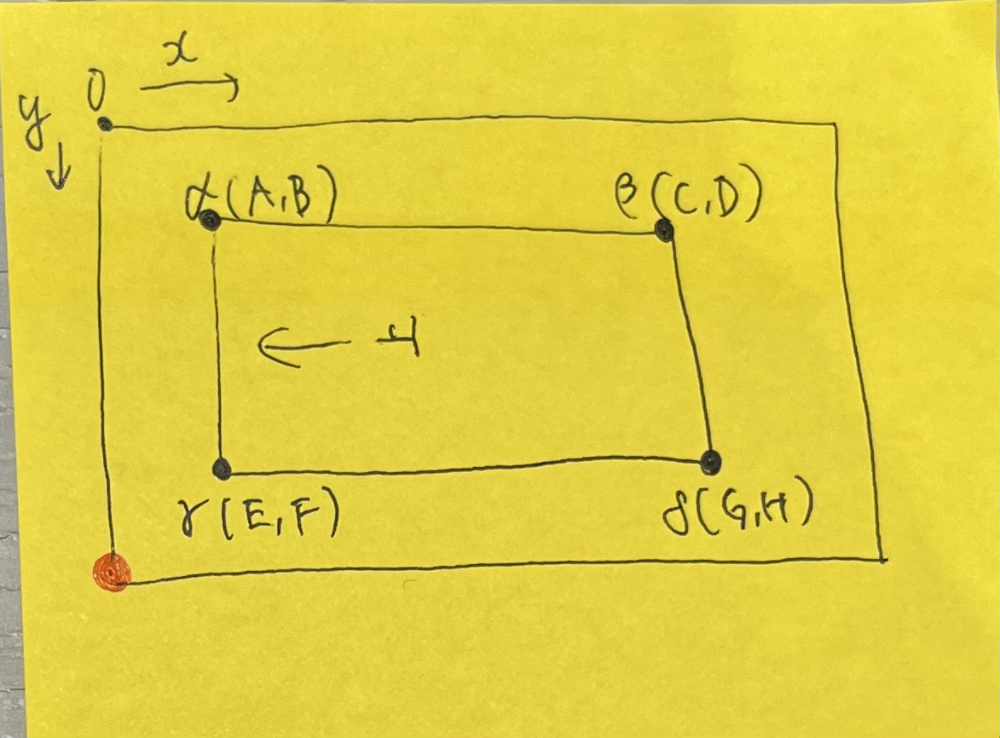

# みんなの書き初め
参考URL: https://studio.kemco.keio.ac.jp/NewYear2023/

# 概要
新春展で使う「みんなの書き初め」のアップロードページと展示ページ
- .htaccess : https://studio.kemco.keio.ac.jp/NewYear20XX/ にアクセスしたときにpiece.phpを表示するためのファイル
- piece.php : 展示用ページ
- piece_ajax.js : いいねボタン用js
- piece_ajax.php : js処理用ページ
- upload.php : 撮影した画像のアップロードページ
- objectreading.py : 撮影用コード
# 使用方法
けむこのサーバにディレクトリ名「NewYear20XX」のディレクトリを作成。とりあえずこのフォルダのものを全部その中に入れる。階層構造はこのまま。
## データベース作成
1. [さくらのレンタルサーバ](https://secure.sakura.ad.jp/rs/cp/)にログイン
2. ショートカットのデータベースをクリック
3. phpMyAdminログインをクリック
4. ログイン後、左のタブからkemco_kakizomeをクリック
5. 新しいテーブルを作成からテーブル名「eto_20XX」(ex:tora_2022)カラム数「４」で作成
6. 上から以下の通り設定し保存
- 名前: id, タイプ: INT, AIにチェック (他に手はつけない, 以下同様)
- 名前: path, タイプ: TEXT, 照合順序:　utf8mb4_general_ci
- 名前: iine, タイプ: INT, デフォルト値: ユーザ定義→0
- 名前: date, タイプDATETIME, デフォルト値: CURRENT_TIMESTAMP

## WEBページ設定＆作成
**!!ファイルの書き換えは必ずファイルをローカルに落とした状態ですること!!**

**!!決してサーバ上で書き換えを行わないこと!!**
### piece.php
1. 13行目を「書き初め20XX」に変更
2. 38行目のFROMの後ろを作成したテーブル名に変更

### piece_ajax.php
1. 22行目のupdateの後ろを作成したテーブル名に変更
2. 24行目のupdateの後ろを作成したテーブル名に変更

### upload.php
1. 37行目INSERT INTOの後ろを作成したテーブル名に変更

以上3ページ変更後サーバにアップし直す。

展示用ページとアップロード用ページにそれぞれアクセスし、まずページがちゃんとあることを確認。

アップロード用ページから何がしかpng画像をアップロードし、正常に完了することを確認。

展示用ページに行き、画像が表示されていることを確認。（多分謎な部分の切り取りになっていると思う、それでOK）

何か問題が起きたら頑張ってください、大体データベースかSQL周りだと思う。。。

## ラズパイ
1. カメラ用に使ってるラズパイがあるから掘り当てる(いくつか起動してみて、objectreading.pyかcamera.pyがあるやつ)
2. objectreading.pyかcamera.pyがなければこのフォルダのobjectreading.pyを移植
3. 27,28行目の年号を変更
4. カメラにつなげてみて、ちゃんと画像が取れるかを確認

## 設営
### カメラとラズパイ
1. ラズパイを起動してobjectreading.pyを実行、カメラを起動させる
2. 半紙はスクリーン側が下になるように配置、できるだけ机と半紙が並行になるように置けるといい。マステで机に四隅をマーキング。
3. 半紙にカメラの影が映らないようにしながら半紙が綺麗に長方形になるように&画像のヘリと辺が並行になるようにカメラの場所とか角度とかを調整する。
4. 場所・カメラ角度が確定したら誰にも触るなと宣言
5. 画像を撮影してみて、元データを宮北さんに送る

### upload.php
1. 宮北さんに画像を送って半紙の四隅の座標を数えてもらう
2. upload.phpの23行目以降を変更する。多分宮北さんはこんな感じの紙をくれるはず↓

- $width = {(F-B)+(D-H)}/2
- $height = {(C-D)+(G-E)}/2
- imagecopyの5個目,6個目の引数: 赤い丸を(0,0)にしたときのγの座標。5個目は(元画像の高さ)-F, 6個目はEになるはず。

3. 必要に応じてImageFilterも編集して明るさとかを調整する。
